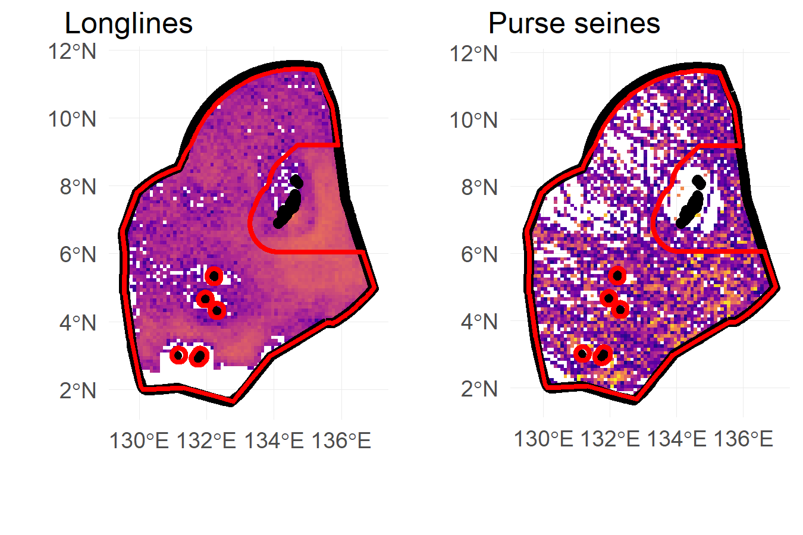

```{r setup, include = FALSE}
knitr::opts_chunk$set(echo = FALSE,
                      message = FALSE,
                      warning = FALSE#,
                      # fig.align = "center"
                      )

suppressPackageStartupMessages({
  library(here)
})
```

## Outline

- Background and motivation

- Scope of the project

- Approach

  - Model and assumptions

- Model predictions

- Phoenix Island Protected Area*

- Palau National Marine Sanctuary
  
- Conclusions

# Background and motivation

## Motivation

- Only 3\% of the ocean under "fully protected" MPAs

- Goals to meet 10 - 30\%

- Opportunity costs of closing areas to fishing

- How do we incentize conservation?

## Motivation

### Guiding question

- Will rights-based approaches to managing natural resources facilitate, or impede large-scale conservation?

- Vessel-day scheme in the PNA region may hold the answer

## Motivation

\begin{center}
	\includemedia[
    label=video1,
    width=300pt,height=225pt,%width=300pt,height=225pt,
	]{}{GFW_video.swf}

    \mediabutton[mediacommand=video1:playPause,
    overface=\color{blue}{\fbox{\strut Play/Pause}},
    downface=\color{red}{\fbox{\strut Play/Pause}}
    ]{\fbox{\strut Play/Pause}}
\end{center}

# Scope and Approach

## Scope

Can economic instruments incentivize conservation?

- For the countries:

  - Does a 30\% closure mean a 30\% effort displacement and therefore a 30\% loss in revenue?

  - What are the costs associated to establishing an MPA?

  - What factors drive these costs?

  - Can these costs be reduced or eliminated by appropriately designing markets?

- For the fishing vessels:

  - Where was effort displaced to?
  
  - How do they respond?

## Approach

- 10-patch model of the tuna purse-seine fishery
  
  - 9 patches under VDS
  - one patch under Open Access

- Profits from fishing in patch $i$ are:

$$\Pi_i = pqE_iX_i\Omega_i-cE_i^\beta$$


$$\Omega_1 = \theta + (1 - \theta)(1 - R)$$

- Vessel-day price must equate the marginal profits from the last unit of effort in patches $i = (1, 9)$

$$\pi_i(E_i) = pqX_i\Omega_i- \beta cE_i^{\beta-1}$$

## Approach

- Patch-level effort is then

$$E_i = \left(\frac{pqX_i\Omega_i - \pi_i}{\beta c }\right) ^ { \frac{1}{\beta - 1}}$$

- Effort is capped at 45,000 vessel-days ($\bar{E}$)

$$\bar{E} = \sum_{i = 1}^9\left(\frac{pqX_i\Omega_i - \pi}{\beta c }\right) ^ {\frac{1}{\beta - 1}}$$

## Approach

- Measure country-level demand curves

  - No trading: price is patch-specific
  
  - Trading: price is the same for all patches

```{r}
# Recortar para que salgan hasta 3000 y 10000 solamente
knitr::include_graphics(path = here("docs", "slides", "img", "demand_curves.png"))
```

# Model predictions

## Model predictions

### Relationship between closure size and losses

Does a 30\% closure mean a 30\% loss in revenue?

## Losses with no trading

```{r}
knitr::include_graphics(here("docs", "slides", "img", "cost_no_trading.png"))
```

## Model predictions

### A market for fishing efforts

- What is the effect of trading?

- Can costs be reduced?

## Trading significantly reduces costs

```{r}
knitr::include_graphics(here("docs", "slides", "img", "cost_with_trading_long_axis.png"))
```

## Trading significantly reduces costs

```{r}
knitr::include_graphics(here("docs", "slides", "img", "cost_with_trading.png"))
```

## Allocation rules matter

- Vessel-days are allocated to countries each year

- Combination of biomass and in-EEZ usage

$$
E_i^* = \alpha \left(\frac{\sum_{\tau = 0}^{\hat{\tau}}E_{i,t-\tau}}{\bar{E}\hat{\tau}} \right) +
(1 - \alpha) \left(\frac{\sum_{\tau = 0}^{\hat{\tau}}X_{i,t-\tau}}{\bar{X}\hat{\tau}} \right)
$$

- $\alpha$ is a weight on historical effort ($E_i$) and historical biomass ($B_i$)

What is the importance of allocation rules?

## "*Biomass-based*" allocation reduces costs

```{r}
knitr::include_graphics(here("docs", "slides", "img", "allocation_cost_plot.pdf"))
```

## What can we learn from PIPA?

PIPA:

- Implemented in January, 2015

- 397,447 $Km^2$

- 2.7\% of total PNA area

- 11\% of Kiribati EEZ

- 22\% of Kiribati EEZ (excluding Line Islands)

GFW data:

- 313 tuna purse seine vessels that fished in PNA

- 92 Fished both before and after PIPA implementation:

  - 64 Fished within PIPA before implementation

- 2012 - Present

## Two "fleets"

```{r}
knitr::include_graphics(here("docs", "slides", "img", "sample_tracks.png"))
```

## Effort displacement in Kiribati

```{r}
knitr::include_graphics(here("docs", "img", "all_PS_VDS_KIR_year.pdf"))
```

## Effort displacement in all PNA

```{r}
knitr::include_graphics(here("docs", "img", "all_PS_VDS_year.pdf"))
```

# Palau

## Palau National Marine Monument

- Close **80\%** of its EEZ to **all** industrial fishing activities

- To be closed December 2020

- Have not evaluted the possible implications

## Likely costs to Palau

```{r, fig.widht = 4, fig.align = "left"}

```

## Fisheries management in Palau

- Purse seine vessel-days

  - 700 purse seine vessel-days
  
  - \$5.60 - \$8.75 Million USD
  
  - "Tradable"
  
  - Trading might reduce costs, but allocation rules matter
  
- Longline vessel-days

  - 10,500 longline vessel-days

  - \$2.10 Million USD
  
  - Non-tradable


## Conclusions

### Rights-based management for conservation

Two market features can eliminate costs of conservation:

- Trading

- Biomass-based allocation


# Extra slides

## GFW summary for Palau

```{r}
knitr::include_graphics(here("docs", "slides", "img", "vessels_in_plw.png"))
```

